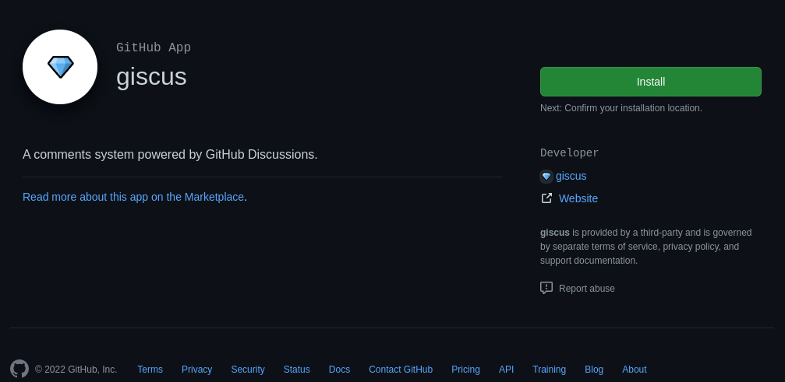
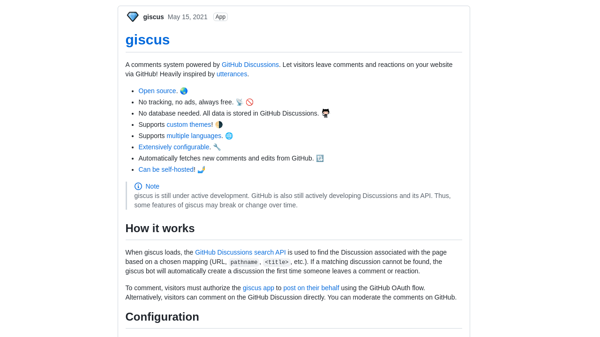

[Giscus](https://github.com/giscus/giscus) is a comments system powered by GitHub discussions. It's free, open-source, and easy to setup. 

## Repository Setup
First, you'll need to make a public repository on GitHub to host the comments. Once created find the [Giscus app](https://github.com/apps/giscus) on the marketplace and click install. Now enable discussions by navigating to Settings > Optional Features and checking `Discussions`.



## Giscus Config
After the steps above are completed, navigate to [Giscus Website](https://giscus.app) to get your config. Once you have your config copy it for the next step.




## Adding Comments Layout
Now enable comments in `config.yml/toml` and save this layout to `layout/partials/comments/comments.html`. If comments aren't showing up try moving comments.html to `layout/partials/comments.html` or refer to theme settings.

*Note: replace script block with your config*

``` html
{{- /* Comments area start */ -}}
<script src="https://giscus.app/client.js"
        data-repo="username/repo"
        data-repo-id="repo-id"
        data-category="Announcements"
        data-category-id="category-id"
        data-mapping="pathname"
        data-reactions-enabled="1"
        data-emit-metadata="0"
        data-input-position="bottom"
        data-theme="preferred_color_scheme"
        data-lang="en"
        data-loading="lazy"
        crossorigin="anonymous"
        async>
</script>
{{- /* Comments area end */ -}}
```