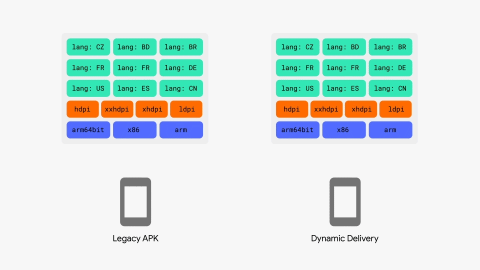

*Gif Courtesy: [Mallow's Blog](https://blog.mallow-tech.com/)*

App Bundles are Google's newest app packaging format for Android. With App Bundles files become smaller, faster to install, and simpler. This works by taking an app then splitting it into a base app and feature splits. Splits are for device specific settings like: dpi, arch, and language. App Bundles use a process called Dynamic Delivery where the app bundle will only install the required splits for your device thus making the install faster and smaller. Now that we know what App Bundles (Split APKs) are and their benefits lets install one.

*I'll just leave this here: [Split-Apk-Installer](https://github.com/mrhaydendp/Split-Apk-Installer)*

## Installing ADB
First, we'll need ADB if you're on Windows I recommend going to my [Fire Tools setup page](https://github.com/mrhaydendp/Fire-Tools/blob/main/Windows-Instructions.md#adb) for instructions. For macOS or Linux use these commands:
``` shell
# Linux
sudo apt install adb

# MacOS: Install Brew then ADB
/bin/bash -c "$(curl -fsSL https://raw.githubusercontent.com/Homebrew/install/HEAD/install.sh)"

brew install android-platform-tools
```

## Installing App Bundle (Split APKs)
Grab an App Bundle from a place like [ApkMirror](https://www.apkmirror.com/) then proceed. Extract your app `Ex: com.google.android.gms_22.21.16.apkm` to a folder using 7-Zip, Tar, etc. Now run adb install-multiple in that folder and your application should install.
```
# Linux/MacOS
adb install-multiple com.google.android.gms-split/*

# Windows
adb install-multiple com.google.android.gms-split\*
```