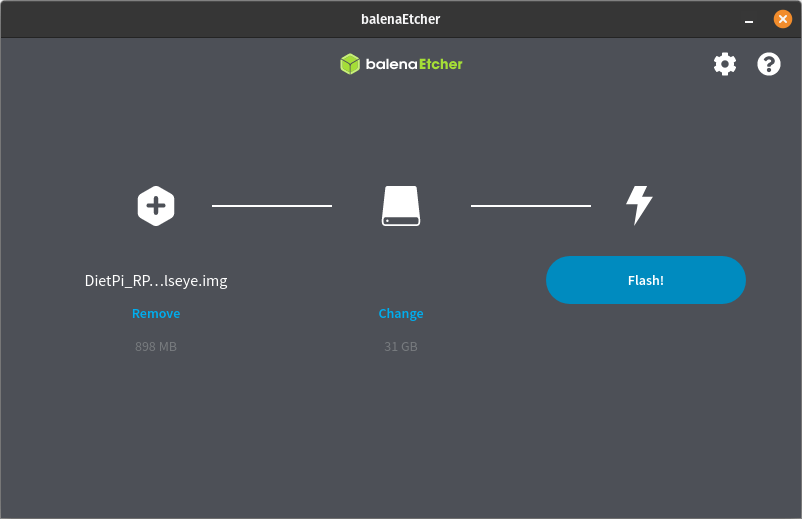
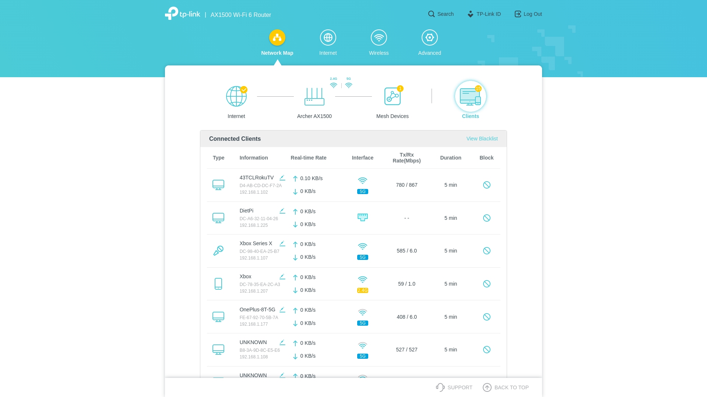
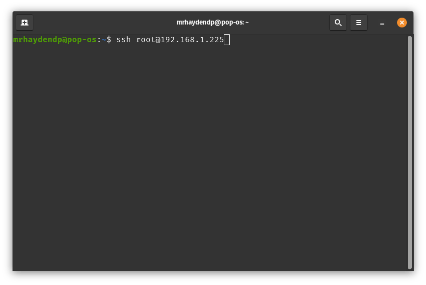
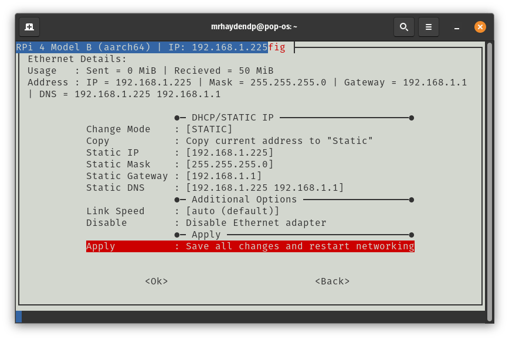
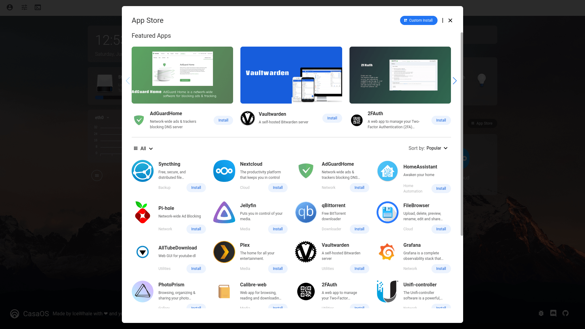

+++
author = "Hayden Plumley"
title = "Raspberry Pi Server"
date = "2022-06-18"
description = "How to setup DietPi & CasaOS on your Pi."
tags = ["Linux"]
categories = ["Tutorials"]
+++

If you've ever considered running Pi-Hole, Jellyfin, or Nextcloud why shell out hundreds of dollars for a PC when you can host these services on a $45 Raspberry Pi 4. Once set-up the Pi can be a pretty amazing low powered server, especially when paired with DietPi and CasaOS. Here's what you'll need to do to install DietPi and CasaOS:

## Materials:
- Raspberry Pi (3B+ or 4 recommended)
- SDCard or USB
- Computer
- Ethernet (preferred but Wi-Fi works too)

## Installing DietPi
To start, you'll first need the latest DietPi image for your Pi. The image can be downloaded from the [DietPi website](https://dietpi.com/), I chose the 64-bit image. Once downloaded you'll need to extract the image using 7-Zip, tar, etc. Now you need to install [Balena Etcher](https://www.balena.io/etcher/) and flash the image to your micro SDCard or USB.
   


## Finding IP Address
Now that our image is flashed plug the Raspberry Pi into power and Ethernet to the router. On your computer navigate to your routers management page (usually 192.168.1.1) and find the clients tab or similar. You should see an Ethernet device show up named DietPi, remember its IP address as we'll use it later for SSH.



## SSH
Now that we have the IP of our device lets SSH into the Pi. Open Terminal (macOS/Linux) or Powershell (Windows) and type `ssh root@192.168.1.xxx` (fill in for your Pi's IP). If all goes well it should ask for a password. The default password is `dietpi`. Finish the DietPi setup then proceed to the next step.



## Static IP
When setup is complete open `Dietpi-Config` and navigate to Network Options: Adapters > Ethernet then change mode from [DHCP] to [STATIC]. Now click Copy to copy current settings to static. When finished click apply, then exit and reboot.



## CasaOS
Now the hard part is over, [CasaOS](https://casaos.io) has a very simple install. Paste this command into your Pi and watch as CasaOS gets installed:

``` bash
curl -fsSL https://get.icewhale.io/casaos.sh | bash 
```

Once installed setup a user account and start installing your favorite services.



<script src="https://giscus.app/client.js"
        data-repo="mrhaydendp/mrhaydendp.github.io"
        data-repo-id="R_kgDOHhopag"
        data-category="General"
        data-category-id="DIC_kwDOHhopas4CPwY_"
        data-mapping="url"
        data-reactions-enabled="1"
        data-emit-metadata="1"
        data-input-position="bottom"
        data-theme="preferred_color_scheme"
        data-lang="en"
        data-loading="lazy"
        crossorigin="anonymous"
        async>
</script>
